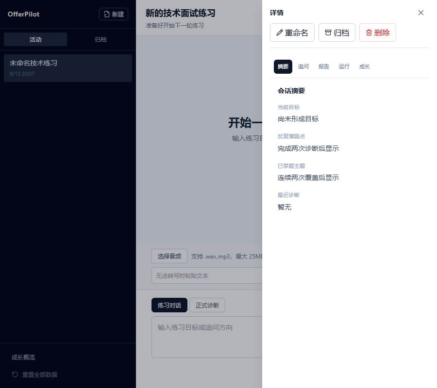

# OfferPilot v4

状态：当前实现。源码与本文件冲突时，以源码和自动化测试为准，并修正文档。

## 产品边界

OfferPilot 是受限的技术面试训练应用，支持练习对话、正式单题诊断、音频转写、报告导出、题库检索和回归 Eval。它不提供开放域问答、简历/JD 分析、多 Agent、TTS 或模拟面试。

## 架构

```text
Browser -> Next.js -> FastAPI
                       |-> Profile / Session / Approval API
                       |-> RunService
                       |    |-> CoachLoop
                       |    |-> Diagnosis Workflow
                       |    |-> ASR / Report Export
                       |-> SQLite + FTS5/RRF + managed audio files
                       |-> Text / Embedding / MiMo providers
```

`Session` 保存历史归属、标题和状态。每次练习、正式诊断、音频转写或报告导出都是一个 `Run`。Run 使用不可变 `trace_id`、持久化事件序列和以下状态机：

```text
pending -> running -> waiting_approval -> running
        -> completed | failed | cancelled | interrupted
```

一个 Session 同时只允许一个活动 Run。事件先提交到 SQLite，再唤醒 SSE 读取方；客户端按 `(trace_id, sequence)` 去重，并可通过 `Last-Event-ID` 或 `after` 重放。

## 身份与安全

- 浏览器身份是 30 天有效的签名 HttpOnly `offerpilot_profile` Cookie，不是账号系统。
- 所有业务资源按 Profile 校验所有权；跨 Profile 查询返回 404。
- 所有浏览器写请求要求显式可信 Origin。
- 管理接口额外要求 `X-OfferPilot-Admin-Key`。
- 日志不得包含 Cookie、密钥、音频内容、候选人回答、Memory 值、私有审批参数、Provider 原文、服务器路径或 SQL 参数。
- 公网环境必须关闭 Debug、使用 HTTPS Origin、Secure Cookie 和至少 32 字节的签名密钥。

## 公共接口

- Profile：`POST /api/profile/bootstrap`、`GET /api/profile/growth`、`POST /api/profile/reset`
- Session：创建、分页、详情、重命名、归档、删除，以及消息、Run、摘要、追问和报告读取
- Run：`POST /api/sessions/{session_id}/runs`，以及快照、事件、SSE 和取消
- Coach 恢复：`GET /api/coach/state?session_id=...`
- Audio：WAV/MP3 上传和手工 Transcript
- Approval：对单个审批作出幂等 approve/deny 决定
- Export：校验报告归属后创建导出 Run
- Admin：知识状态/重建、Eval、Run 和脱敏操作日志

Run 创建必须提供 `Idempotency-Key`。审批绑定 Run、Session、Profile、Trace 和 Flow；私有参数与服务器文件路径不会返回浏览器。旧 Coach、Trace、Progress、Checkpoint 和 Resume 路由不再注册。

## Coach、RAG 与诊断

Coach 是受限 Agent，当前有 5 个可由模型调用的工具：

1. `search_knowledge`
2. `get_practice_profile`
3. `list_recent_reports`
4. `recommend_next_question`
5. `save_memory`

`transcribe_audio` 和 `export_report` 是受审批 Run 工作流，不计入 Agent Tools。

知识条目使用稳定考点 ID。检索采用 FTS5 与 Embedding 双通道并通过 RRF 合并。正式诊断只把当前回答作为评分证据；Session Summary、已批准 Memory 和最近消息只提供练习背景。

## 数据与运行边界

- 数据结构集中在 `src/api/offerpilot/database/schema.sql`。
- SQLite 启用外键、WAL 和 busy timeout，是单实例事实源。
- 启动只执行幂等建表和索引，不维护版本迁移历史。
- 开发期 Schema 变化通过停止服务、备份所需数据并重建本地数据库处理。
- 当前音频仅支持 WAV/MP3、最大 25MB；审批结束、失败、取消、过期、Session 删除或 Profile Reset 后清理受管文件。
- 部署边界是一台 API、一个进程内 RunService、一台 Web 和一个 SQLite Volume；不支持多实例调度。

## 可观察性

当前已记录 HTTP、Provider、ASR、RAG 阶段耗时，Run 的排队/审批/执行/总耗时，以及正式诊断的 Token Usage 和首 Token。Coach Token、逐次 Tool 耗时和统一 Run 费用账本尚未实现，属于 v5 范围。

## 验收

```powershell
& .\.venv\Scripts\python.exe -m pytest
& .\.venv\Scripts\python.exe -m mypy src\api\offerpilot
& .\.venv\Scripts\python.exe -m compileall -q src\api\offerpilot
Push-Location src\web
npm.cmd run build
npm.cmd run test:e2e
Pop-Location
docker compose config --quiet
git diff --check
```

真实 Provider、浏览器 E2E、Compose 启动和重启恢复是独立证据门槛，不能用 Mock 结果代替。当前 MiMo ASR 真实探针受 HTTP 402 额度问题阻塞。

## 界面快照



下一版本规划见 [v5](../v5/README.md)。
